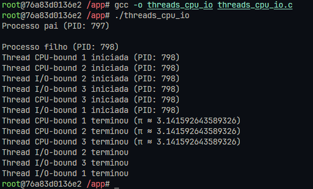

# Relatório de Atividade Prática de Escalonamento de Tarefas

## Informações Gerais
- **Título:** Atividade 04 - Prática de escalonamento de tarefas
- **Nome:** Gustavo José Teixeira Tavares
- **Data:** 07/06/2025

## Introdução

Este relatório documenta a realização da atividade prática sobre escalonamento de tarefas. O objetivo foi observar e comparar o comportamento de diferentes tipos de threads (CPU-bound e I/O-bound) em um programa C, analisando como o sistema operacional prioriza e agenda essas tarefas com diferentes perfis de uso de recursos.

## Execuçõs

### Construção da Imagem e Execução do Container

Primeiro, construí a imagem Docker usando o Dockerfile e executei o container

### Compilação e execução do Programa original

Logo após compilei e executei o programa original utilizando o compilador gcc.

### Compilação e execução do Programa alterado

Conforme solicitado, modifiquei o programa original `threads_cpu_io.c` para:

1. Adicionar mais uma thread de cada tipo (totalizando 3 threads CPU-bound e 3 threads I/O-bound)
2. Alterar o cálculo na thread CPU-bound para o cálculo do número π usando a série de Leibniz

Após a alteração do programa executei ele novamente

### Monitorando performance

Instalação do pacote `perf` para monitorar performance, essa ferramenta permite a coleta de estatísticas detalhadas sobre o uso da CPU, cache, ciclos de clock, entre outros.

esse é o monitoramento geral do sistema em tempo real

resultado do código alterado

## Conclusão
Nessa atividade, entendi um pouco a diferença entre threads CPU-bound e I/O-bound e como isso impacta o escalonamento no sistema operacional. Descobri também como o kernel do Linux dá prioridade para as threads I/O-bound, o que ajuda a aumentar o desempenho do sistema.